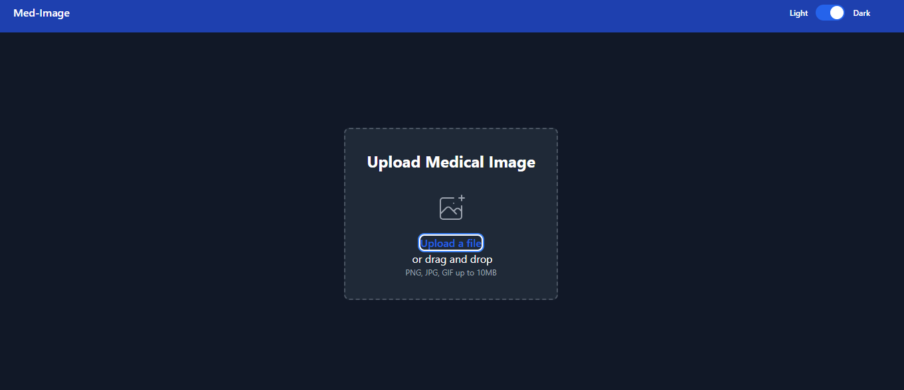
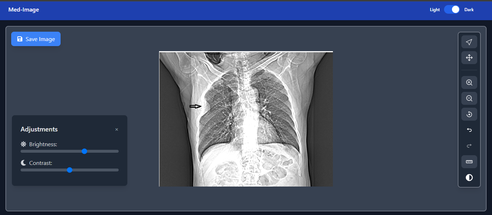
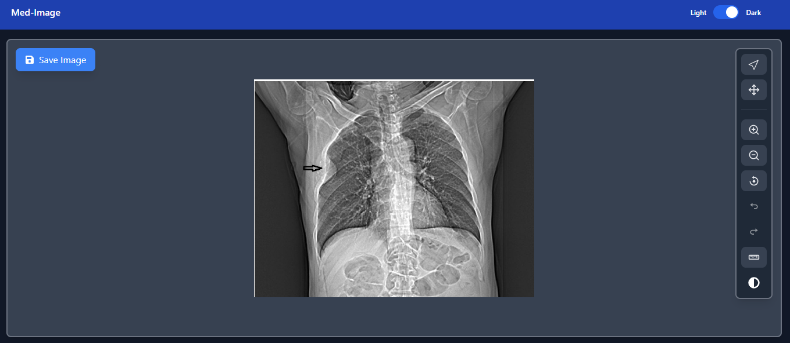
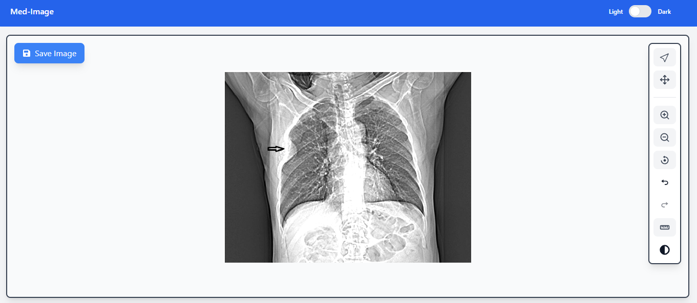
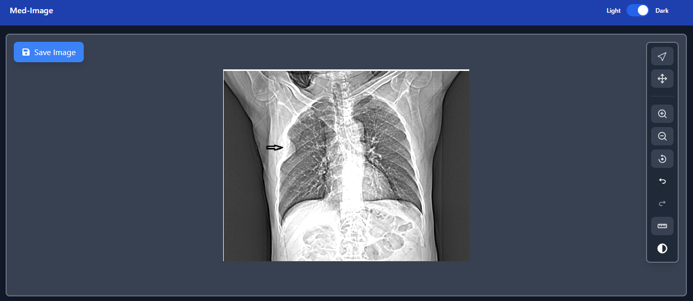
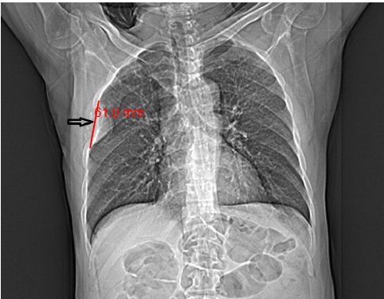
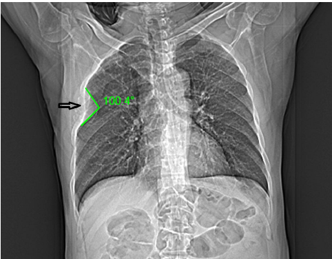

# Medical Image Viewer Documentation

## Table of Contents

1. [Tech Stack](#tech-stack)
2. [Setup Guide](#setup-guide)
3. [Functionality Description](#functionality-description)
4. [Workflow](#workflow)
5. [Screenshots](#screenshots)

## Tech Stack

This project is built using the following technologies:

- **React**: A JavaScript library for building user interfaces.
- **TypeScript**: A superset of JavaScript that adds static types, enhancing code quality and maintainability.
- **Tailwind CSS**: A utility-first CSS framework for rapid UI development.
- **React Icons**: A library for including icons in React applications.
- **Vercel**: A platform for deploying frontend applications.

## Setup Guide

To set up the project locally, follow these steps:

### Prerequisites

- Ensure you have [Node.js](https://nodejs.org/) installed (version 14 or higher).
- Install [npm](https://www.npmjs.com/) (comes with Node.js).

### Installation Steps

1. **Clone the Repository**:
   ```bash
   git clone <repository url>
   cd med-image
   ```

2. **Install Dependencies**:
   Run the following command to install the required packages:
   ```bash
   npm install
   ```

3. **Start the Development Server**:
   To run the application in development mode, use:
   ```bash
   npm start
   ```
   Open your browser and navigate to [http://localhost:3000](http://localhost:3000).

4. **Build for Production**:
   To create an optimized build for production, run:
   ```bash
   npm run build
   ```
   This will generate a `build` directory containing the production-ready files.

## Functionality Description

The Medical Image Viewer application provides several key functionalities:

### 1. Image Upload
- Users can upload medical images by dragging and dropping them into the designated area or by selecting files from their device.

### 2. Image Adjustments
- Users can adjust the brightness and contrast of the uploaded images using sliders. This allows for better visibility and analysis of the images.

### 3. Measurement Tools
- The application includes various measurement tools that allow users to measure distances and angles directly on the images. Here's how to use them:

  - **Line Measurement**:
    - Select the line measurement tool from the toolbar.
    - Click on the starting point of the measurement on the image.
    - Drag the mouse to the endpoint and click again to finalize the measurement.
    - The distance will be displayed on the image.

  - **Angle Measurement**:
    - Select the angle measurement tool from the toolbar.
    - Click on the first point to define one vertex of the angle.
    - Click on the second point to define the other vertex.
    - Finally, click on the third point to complete the angle.
    - The angle measurement will be displayed on the image.

  - **Circle Measurement**:
    - Select the circle measurement tool from the toolbar.
    - Click on the center of the circle you want to measure.
    - Drag the mouse outward to define the radius and click again to finalize.
    - The radius and area will be displayed on the image.

### 4. Zoom and Pan
- Users can zoom in and out of the images for detailed inspection. The pan functionality allows users to move around the image when zoomed in.

### 5. Undo/Redo Functionality
- Users can easily revert or redo actions taken during image analysis, providing flexibility in their workflow.

### 6. Dark Mode
- The application supports dark mode, allowing users to switch between light and dark themes for a better viewing experience in different lighting conditions.

## Workflow

1. **Upload Image**: Users can upload a medical image using the drag-and-drop feature or by selecting a file.
2. **Adjust Image**: Once uploaded, users can adjust brightness and contrast to enhance visibility.
3. **Measure**: Users can utilize measurement tools to analyze distances and angles on the image.
4. **Zoom and Pan**: Users can zoom in for detailed inspection and pan around the image.
5. **Save Changes**: Users can save the adjusted image for future reference.
6. **Toggle Dark Mode**: Users can switch between light and dark themes for better visibility based on their environment.

## Screenshots

Here are some screenshots of the Medical Image Viewer application:

### 1. Image Upload Interface


### 2. Image Adjustments


### 3. Uploaded Image Interface



### 4. Light and Dark Mode



### Results
- **Length Measurement Result**: 
  
  
- **Angle Measurement Result**: 
  

## Conclusion

This documentation provides an overview of the Medical Image Viewer project, including the tech stack, setup instructions, functionality descriptions, workflow, and screenshots. For any further questions or contributions, feel free to reach out or submit a pull request.
